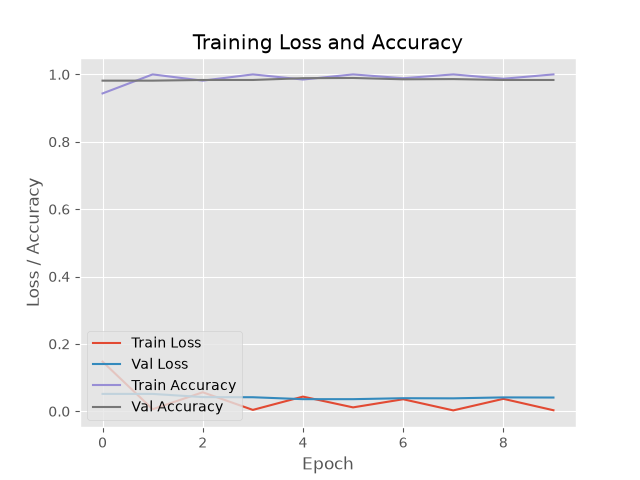

# Face Mask Detector

A real-time face mask detection system built using Deep Learning and Computer Vision. The model detects whether a person is wearing a face mask or not — from a live webcam feed or uploaded image.

---

##  Project Overview

This project fine-tunes a pre-trained **MobileNetV2** model on a labeled face mask dataset using Transfer Learning. It achieves **99% test accuracy** with high precision and recall on both classes.

---

##  Model Performance

| Metric | With Mask | Without Mask |
|--------|-----------|--------------|
| Precision | 0.98 | 0.99 |
| Recall | 0.99 | 0.98 |
| F1-Score | 0.99 | 0.99 |
| **Overall Accuracy** | **99%** | — |

> Evaluated on 1,511 test images from a dataset of 7,500+ labeled images.

---

## Tech Stack

| Purpose | Tool |
|---|---|
| Language | Python 3.11 |
| Deep Learning | TensorFlow / Keras |
| Pre-trained Model | MobileNetV2 (ImageNet weights) |
| Computer Vision | OpenCV |
| Data Processing | NumPy, Scikit-learn |
| Web App | Streamlit |
| Visualization | Matplotlib |

---

##  Features

-  Real-time webcam-based mask detection
-  Image upload detection via Streamlit web app
-  Bounding boxes with confidence scores on each detected face
-  Transfer Learning with frozen MobileNetV2 base
-  Data augmentation for better generalization
-  Deployed as a live web app (no local setup needed)

---

##  Project Structure

```
face_mask_detector/
├── dataset/
│   ├── with_mask/          # ~3,800 images
│   └── without_mask/       # ~3,800 images
├── train_model.py          # Model training script
├── detect_mask.py          # Real-time webcam detection
├── app.py                  # Streamlit web app
├── mask_detector.h5        # Saved trained model
├── training_plot.png       # Accuracy & loss curves
└── requirements.txt        # Dependencies
```

---

##  How to Run Locally

### 1. Clone the Repository
```bash
git clone https://github.com/nitya7788/face-mask-detector.git
cd face-mask-detector
```

### 2. Install Dependencies
```bash
pip install -r requirements.txt
```

### 3. Train the Model
```bash
python train_model.py
```

### 4. Run Webcam Detection
```bash
python detect_mask.py
```
Press **Q** to quit.

### 5. Launch Web App
```bash
streamlit run app.py
```
Opens at `http://localhost:8501`

---

## How It Works

```
Input (Webcam / Image)
        ↓
Face Detection (OpenCV Haar Cascade)
        ↓
Face Region Cropped & Resized to 224×224
        ↓
MobileNetV2 Feature Extraction
        ↓
Custom Dense Layers → Binary Classification
        ↓
Output: Mask ✅ or No Mask ❌ + Confidence Score
```

---

## Training Results

- **Dataset:** 7,500+ images (with_mask / without_mask)
- **Train/Test Split:** 80% / 20%
- **Epochs:** 10
- **Final Train Accuracy:** ~100%
- **Final Validation Accuracy:** 98.54%
- **Test Accuracy:** 99%



---

## Key Concepts Used

- Transfer Learning (MobileNetV2 pre-trained on ImageNet)
- Convolutional Neural Networks (CNNs)
- Data Augmentation (rotation, zoom, flip)
- Binary Classification (sigmoid output)
- OpenCV face detection (Haar Cascades)
- Model deployment with Streamlit

---

##  Dataset

Dataset used: [Face Mask Dataset — Kaggle](https://www.kaggle.com/datasets/omkargurav/face-mask-dataset)

~7,500 images split into two classes:
- `with_mask` — 3,725 images
- `without_mask` — 3,828 images

---

##  Author

**Nitya Singh**  
GitHub: [@nitya7788](https://github.com/nitya7788)

---

##  License

This project is open source and available under the [MIT License](LICENSE).
